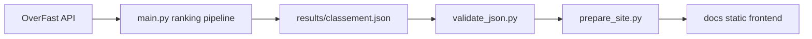

# Overwatch Ranker

Static ranking site and the original Python calculation pipeline for a configured Overwatch player set.

The presentation layer is new; `main.py`, `config.py`, `heroes.py`, and `viewer.py` remain available. The browser reads generated JSON only. It never calls Tkinter or OverFast.

## Upstream, rights, and publication gate

This project is derived from [Zenitude71/overwatch-rancker](https://github.com/Zenitude71/overwatch-rancker). The upstream repository declares no license and provides no image provenance. The inherited `images/` PNGs are omitted from the static site; `prepare_site.py` copies them only when explicitly given `--allow-hero-assets`, which this branch does not use.

This branch contains no Pages workflow, and Pages is not configured on the fork. No public deployment is enabled.

## Architecture



`main.py` preserves the original numerical contract: hero/mode payload precedence, the `heroes.HERO_ROLES` allowlist, pseudo extraction before the first hyphen, Quickplay/Competitive accumulation, positive-only total lookup, average × `time_played / 600` reconstruction, `games_won / 0.5` game estimation, 100% winrate cap, death denominator fallback of one, rounded emitted fields, threshold filtering with top-two fallback, per-hero relative min-max normalization, equal/reversed normalization result of one, role coefficients, score/time sorting, UTF-8 field names, omitted `Morts_Moyenne`, and summary ordering.

The ranking is relative within each hero. Partial populations can change relative scores. Games and reconstructed averages can be estimates. A request is eligible only when it is configured and not present in `config/collection_policy.json`; that policy is explicit and auditable, not a silent exclusion mechanism.

## Collection policy and probes

There are 10 configured players × 2 modes = 20 logical requests. Two consecutive read-only probes on 2026-10-09 confirmed HTTP 404 twice for these four requests:

- `Colbern-2193` / `quickplay`
- `Colbern-2193` / `competitive`
- `lasthigh-21178` / `quickplay`
- `lasthigh-21178` / `competitive`

They are excluded in `config/collection_policy.json` with both observation timestamps, reasons, and `confirmed_twice` status. The current eligible population is 16 requests. Valid 200 responses with no recognized played heroes remain eligible as legitimate empty modes.

`main.main()` returns an auditable report with configured, excluded, expected, attempted, successful, private/unavailable, transient, invalid, and `complete` counters. Fresh publication requires every eligible request to be attempted successfully and the generated JSON to pass validation. Transport errors and HTTP 429/5xx retry at most three times with bounded exponential delays; 403/404 and other non-retryable statuses fail the eligible run immediately.

Run a probe without writing `results/`:

```text
python scripts/probe_collection.py --output <temporary>/probe.json
```

Run it twice before changing the policy. A candidate permanent exclusion requires matching non-retryable observations in both reports.

## Data contract and frontend

`results/classement.json` must have exactly `Résumé_Joueurs`, `Tank`, `Damage`, and `Support`. Summary entries are keyed directly by pseudo and contain only `Temps_Jeu_Total_Heures`. Ranking records contain the emitted numeric fields, finite values, scores in `[0, 100]`, and unique pseudos per hero. Empty hero lists are valid; a completely empty dataset is not.

`docs/index.html`, `docs/style.css`, and `docs/app.js` form a relative-path static frontend. It provides role/hero controls, exact summary-object rendering, search, keyboard-sortable columns, stale metadata, accessible empty/error states, and mobile table scrolling. Visual sorting and search wrap records with their original zero-based index; the visible position is always the producer's canonical rank. JavaScript never recalculates scores, averages, totals, or rankings.

The required metadata pair is:

```json
{
  "generated_at": "ISO-8601 UTC",
  "source_generated_at": "ISO-8601 UTC",
  "is_stale": false,
  "run_id": "non-empty run identifier"
}
```

## Local development

```text
python -m pip install -r requirements.txt -r requirements-dev.txt
python -m pytest -q
python scripts/validate_json.py tests/fixtures/classement-valid.json
```

The fixtures under `tests/fixtures/` are synthetic test inputs only. They are never copied into production `docs/`.

For a local generated pair:

```text
python main.py
python scripts/validate_json.py results/classement.json
python scripts/prepare_site.py --dataset results/classement.json --metadata <metadata.json> --output docs --repo-root .
```

`prepare_site.py` refuses missing or invalid input, replaces only generated site data, and copies hero PNGs only with the explicit `--allow-hero-assets` switch.

Browser development requires Node/npm and the committed lockfile:

```text
npm ci
npx playwright install chromium
npm test
```

The deterministic Playwright server maps `docs/` below `/overwatch-rancker/` so relative CSS, JavaScript, JSON, and asset paths are exercised.

